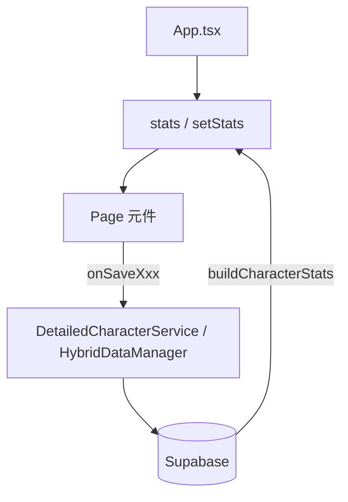

# 專案代碼架構

供 AI 與新協作者快速掌握專案架構、慣例與風格，減少風格不一致。

## 設計原則

1. **手機優先**：UI 以手機版網頁為主要設計目標，盡可能讓文字越大越清晰越好。
2. **共用優先**：能共用的元件、樣式就盡可能共用；新設計的元件與樣式也要以「後續可被他人共用」為原則。

---

## 1. 目錄結構

| 路徑 | 職責 |
|------|------|
| `App.tsx` | 中央狀態、Tab 路由、`stats` / `setStats`、`onSaveXxx` callbacks |
| `components/` | 頁面與 Modal；`ui/` 下為共用 UI（如 `Modal.tsx`、`FilterBar.tsx`） |
| `services/` | 資料存取：`hybridDataManager.ts`、`detailedCharacter.ts` 等 |
| `utils/` | helpers、`characterConstants.ts`、`appInit.ts`（組裝 CharacterStats）、`characterAttributes.ts`（basic+bonus 計算） |
| `styles/` | `modalStyles.ts`、`common.ts`（STYLES、combatStyles、combineStyles） |
| `types.ts` | `CharacterStats`、`CustomRecord`、`ClassInfo` 等前端型別 |
| `lib/supabase.ts` | DB 型別（`CharacterCurrentStats` 等） |
| `src/test/` | Vitest 測試 |
| `hooks/` | `useAppInitialization.ts`、`useToast.ts` |
| `contexts/` | `AuthContext.tsx` |

---

## 2. 資料流

- **角色資料**：`stats`（CharacterStats）為單一來源
- **儲存**：各頁面收到 `onSaveXxx`，呼叫 Service，成功後 `setStats` 更新本地
- **載入**：`buildCharacterStats`（`utils/appInit.ts`）從 DB 組裝 `CharacterStats`

---

## 3. 元件慣例

- **共用優先**：能複用既有元件就複用；新元件設計時考慮通用性，供後續場景共用

### Modal

- 使用 [components/ui/Modal.tsx](components/ui/Modal.tsx)（`Modal`、`ModalButton`、`ModalInput`）
- 內容包在 [MODAL_CONTAINER_CLASS](styles/modalStyles.ts) 內
- Props：`isOpen`、`onClose`、資料與 `onSave`/`onDelete` callback
- 獨立檔案：`XxxModal.tsx`（如 CombatNoteModal、ItemDetailModal）
- **加值來源列表**：NumberEditModal、CombatStatEditModal、CombatHPModal 可傳 `bonusSources`（`{ label, value }[]`），顯示「加值來源」標題與列表（正負值顏色區分），總計使用 [FinalTotalRow](components/ui/FinalTotalRow.tsx)
- **影響角色數值**：[StatBonusEditor](components/StatBonusEditor.tsx) 用於能力/物品的「影響角色數值」編輯；在 CharacterItemEditModal、GlobalItemFormModal、AbilityFormModal 中此區塊位於「描述」下方；上傳到資料庫時會帶入 local 的 affects_stats / stat_bonuses 並寫入 DB
- 戰鬥頁其餘彈窗：CombatHPModal、CombatItemEditModal、CategoryUsageModal、RestOptionsModal、ShortRestDetailModal、LongRestConfirmModal、EndCombatConfirmModal 等

### Page 元件

- 接收 `stats`、`setStats`、`characterId`、`onSaveXxx`（可選）
- 使用 lazy 載入

---

## 4. 樣式慣例

- **手機優先**：字體大小、點擊區域、間距皆以手機閱讀體驗為準，文字越大越清晰越好
- [styles/modalStyles.ts](styles/modalStyles.ts)：`MODAL_CONTAINER_CLASS`、`INPUT_FULL_WIDTH_CLASS`、`BUTTON_PRIMARY_CLASS` 等
- [styles/common.ts](styles/common.ts)：`STYLES`、`combineStyles`、`conditionalStyle`
- Tailwind：深色主題（slate-900/950）、amber 強調色、響應式 `sm:`
- **共用優先**：新樣式盡量放到共用檔，命名具語意、可複用，便於後人共用

---

## 5. 常數與型別

- [utils/characterConstants.ts](utils/characterConstants.ts)：`STAT_LABELS`、`SKILLS_MAP`、`ABILITY_KEYS`（與 CharacterSheet、CombatView 共用）
- `types.ts`：`CharacterStats`、`CustomRecord`、`ClassInfo` 等
- `lib/supabase.ts`：DB 對應型別（`CharacterCurrentStats` 含 `combat_notes` 等）

### 5.1 屬性 basic + bonus 規則

- **basic + bonus = final**：戰鬥屬性（AC、先攻、速度、HP max、攻擊命中、攻擊傷害、法術命中、法術 DC）皆採此結構。
- **basic 可編輯**：使用者可直接編輯 basic 值。
- **bonus 來源**：bonus 由 (1) 能力/物品的 stat_bonuses 聚合（經 `extra_data.statBonusSources` 與各 combat/技能/豁免加總）、(2) DB 的 misc bonus 欄位（可編輯的「其他加值」）組成；各 Modal 會顯示「加值來源」列表（含來源名稱與數值）。
- 取得 final 值請使用 [utils/characterAttributes.ts](utils/characterAttributes.ts)：
  - `getFinalCombatStat(stats, key)`：AC、先攻、速度、maxHp、attackHit、attackDamage、spellHit、spellDc（已含 statBonusSources 加總）
  - `getBasicCombatStat(stats, key)`：取得 basic（供編輯用）
  - `getFinalAbilityScore` / `getFinalAbilityModifier`：6 屬性值／調整值（含 extra_data.abilityBonuses、modifierBonuses）
  - `getFinalSavingThrow(stats, abilityKey)`：6 豁免（含 statBonusSources.savingThrows）
  - `getFinalSkillBonus(stats, skillName)`：18 技能（含 extra_data.skillBonuses 與 statBonusSources）

### 5.2 DB 欄位與 CharacterStats 對應

| CharacterStats key | DB 欄位 (character_current_stats) |
|--------------------|-----------------------------------|
| ac                 | ac_basic, ac_bonus                |
| initiative         | initiative_basic, initiative_bonus|
| speed              | speed_basic, speed_bonus          |
| maxHp              | max_hp_basic, max_hp_bonus        |
| attackHit          | attack_hit_basic, attack_hit_bonus（原 weapon_attack_bonus 更名為攻擊命中） |
| attackDamage       | attack_damage_basic, attack_damage_bonus（原 weapon_damage_bonus 更名為攻擊傷害） |
| spellHit           | spell_hit_basic, spell_hit_bonus（法術命中） |
| spellDc            | spell_dc_basic, spell_dc_bonus（法術 DC）   |
| skillBonuses       | character_skill_proficiencies.misc_bonus    |
| saveBonuses        | character_saving_throws.misc_bonus          |

- **extra_data（JSONB）**：由 [detailedCharacter.getFullCharacter](services/detailedCharacter.ts) 聚合寫入，包含：
  - `abilityBonuses`、`modifierBonuses`、`skillBonuses`：來自能力/物品的 stat_bonuses 加總
  - `statBonusSources`：每筆來源（能力或物品名稱 + 其 stat_bonuses 明細），供 Modal「加值來源」列表與最終值計算使用
- **能力/物品數值加值**：`abilities`、`global_items` 與 `character_abilities`、`character_items` 皆有 `affects_stats`、`stat_bonuses`（JSONB）；角色層未覆寫時以 ability/item 為準，上傳到資料庫時會寫入 affects_stats / stat_bonuses。

---

## 6. 服務層

- **HybridDataManager**（[services/hybridDataManager.ts](services/hybridDataManager.ts)）：統一角色資料存取介面
- **DetailedCharacterService**（[services/detailedCharacter.ts](services/detailedCharacter.ts)）：角色 CRUD、`updateCurrentStats`、`updateExtraData`；`getFullCharacter` 會聚合角色能力/物品的 `affects_stats`、`stat_bonuses` 並寫入 `extra_data`（abilityBonuses、modifierBonuses、skillBonuses、statBonusSources），供 [buildCharacterStats](utils/appInit.ts) 組裝 CharacterStats
- DB 欄位：`character_current_stats`（含 `combat_notes`）、`extra_data`（JSONB）；能力/物品的 `affects_stats`、`stat_bonuses` 見 5.2

---

## 7. 資料庫遷移

- 若有需要更新 DB，建立 migration 後**立即**執行推送
- 參考 [database-migration.md](database-migration.md)：`npm run db:create "描述"` 建立、`npm run db:migrate` 推送到遠端 DB
- 重要：只要有新增 migration，必須立即推送到遠端 DB
- 範例：`20260213000000_add_stat_bonuses_to_abilities_and_items.sql`、`20260213000001_add_stat_bonuses_to_character_abilities_and_character_items.sql` 為 abilities / global_items / character_abilities / character_items 新增 `affects_stats`、`stat_bonuses` 欄位

---

## 8. 測試慣例

- 檔名：`Xxx.test.ts` 或 `Xxx.feature.test.tsx`
- Mock：`vi.mock('../../services/hybridDataManager')`、localStorage
- 參考 [ai-workflow.md](ai-workflow.md)：先寫測試、再實作

---

## 9. 程式風格

- 命名：camelCase（變數、函式）、PascalCase（元件、型別）
- UI 文案：繁體中文
- 註解：檔案頂部用途、複雜邏輯說明
